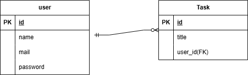

# タスク管理アプリ

## 概要
日常生活や業務において「すぐにメモしたい」「タスクを整理したい」という課題を解決するために開発した、シンプルなタスク管理Webアプリです。

Java（Servlet / JSP）を用いて、設計から実装まで一貫して個人で開発しました。

---

## デモ
※デプロイURLを記載（例：https://xxx.com）

---

## 使用技術
- バックエンド：Java（Servlet / JSP）
- フロントエンド：HTML / CSS 
- データベース：MySQL
- サーバー：Apache Tomcat
- 開発環境：Eclipse IDE

---

## システム構成図
本アプリは、MVCモデルを意識し、フロントエンド・サーバーサイド・データベースを分離した構成としています。

---

## ER図
ユーザーとタスクを1対多の関係で管理しています。

---

## 主な機能
- ユーザー登録 / ログイン機能（認証機能）
- タスクの投稿機能
- タスクの編集 / 削除機能

---

## 工夫した点

### セキュリティ対策
- SQLインジェクション対策としてPreparedStatementを使用
- 不正なリクエストに対するバリデーションを実装

### UI/UXの改善
- シンプルで直感的に操作できる画面設計
- 最小限の操作でタスク管理ができる導線設計
- エラーメッセージを分かりやすく表示

---

## 課題・今後の改善

### 現状の課題
- 基本的なCRUD機能の実装にとどまっている

### 今後の改善予定
- タスクごとの期限設定機能の追加
- 詳細情報（説明・優先度など）の追加
- タスクの並び替え・検索機能の実装
